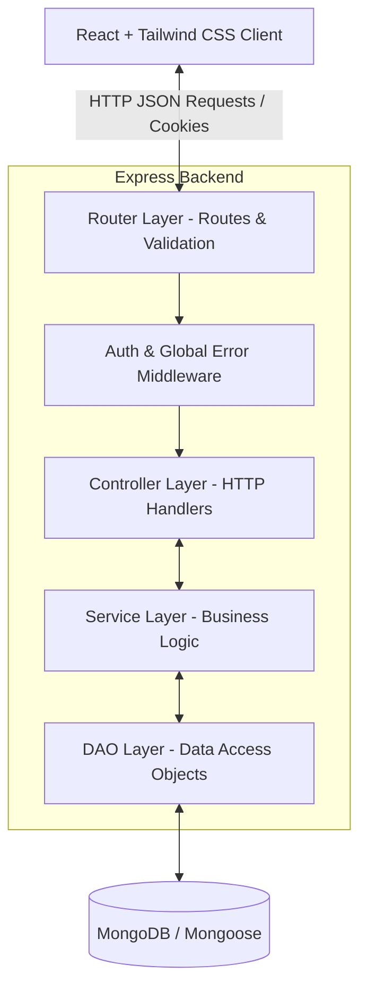

# 🔗 LinkHub — The Ultimate Bio Link Manager

> A high-fidelity, layered-architecture Linktree built with Node.js, Express, TypeScript, Mongoose, and React.

---

## 📌 The Problem & The Solution

_Ever felt limited by the single link in your bio?_

Whether it's YouTube, LinkedIn, GitHub, portfolio, LeetCode, or X — you have multiple places you want people to visit, but your bio only allows one link. That's exactly the problem **LinkHub** solves.

LinkHub lets you add all your important links in one place, and gives you a single shareable URL that you drop in your bio. Anyone who visits it sees all your links — clean, simple, and in one place.

---

## ⚙️ Architecture & Code Flow

LinkHub follows a strict **Layered (Multi-tier) Architecture** to ensure clean separation of concerns, testability, and high modularity.



---

## 🚀 API Endpoints

### Authentication

| Method | Endpoint             | Description                              | Auth Required |
| :----- | :------------------- | :--------------------------------------- | :-----------: |
| `POST` | `/api/auth/register` | Register a new user account              |      No       |
| `POST` | `/api/auth/login`    | Login user, issue JWT token & set cookie |      No       |
| `POST` | `/api/auth/logout`   | Clear session cookie                     |      Yes      |

### Link Management & Public Profile

| Method | Endpoint                      | Description                                     | Auth Required |
| :----- | :---------------------------- | :---------------------------------------------- | :-----------: |
| `POST` | `/api/links`                  | Create a new link for the logged-in user        |      Yes      |
| `GET`  | `/api/links/:user`            | Get all public links of a user (ID or username) |      No       |
| `GET`  | `/api/links/:user/analytics`  | Get views, clicks, and individual link CTR      |  Yes (Owner)  |
| `GET`  | `/api/links/redirect/:linkId` | Track click count and redirect to destination   |      No       |

---

## 🛠️ Local Setup Guide

### 1. Prerequisites

- **Node.js** (v18.x or higher)
- **pnpm** (recommended) or **npm**
- **MongoDB** running locally or via Docker

---

### 2. Install Dependencies

Clone the repository and install dependencies for both the frontend and backend:

```bash
# Install backend dependencies
cd server
pnpm install

# Install frontend dependencies
cd ../client
pnpm install
```

---

### 3. Configure Environment Variables

Create `.env` file and fill in the details:

```env
PORT=6969
MONGODB_URI=mongodb://localhost:27017/linkhub
JWT_SECRET=your_super_secret_jwt_key
NODE_ENV=development
```

---

### 4. Running the Project Locally

#### **Development Mode (Concurrent)**

To run the frontend and backend concurrently with hot reloading:

```bash
# Start backend (port 6969)
cd server
pnpm run dev

# Start frontend (port 5173 - proxies requests to 6969)
cd ../client
pnpm run dev
```

#### **Production Mode (Served from Backend)**

To build the static React frontend and serve it directly from the Express server:

```bash
# Build & start production server
cd server
pnpm run build
pnpm run start
```

Visit `http://localhost:6969` to view your production application.

---

## 🔮 Future Scopes

- [ ] **Password-Protected Links:** Require visitors to enter a password to access premium, early access, or sensitive links.
- [ ] **Social Media Icon Strip:** Add a dedicated, highly recognizable quick-action icon bar (Instagram, LinkedIn, X, GitHub) directly beneath the profile bio.
- [ ] **Geolocation Analytics:** Track visitor regions, browser agents, and referrals to generate interactive heatmaps on the dashboard.
- [ ] **Custom Domain Names:** Provide capability for pro users to map their own custom domain name directly to their LinkHub profile.
